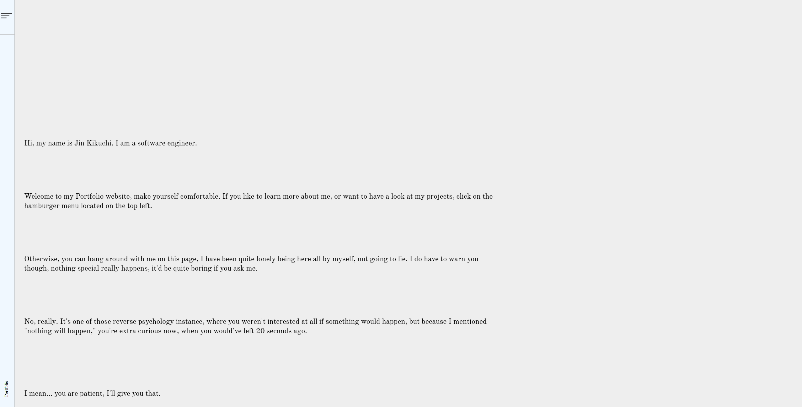
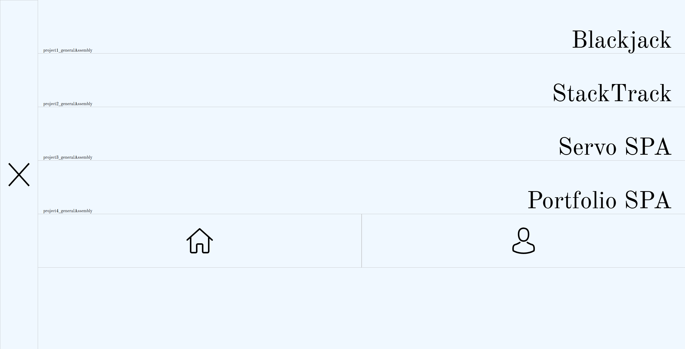
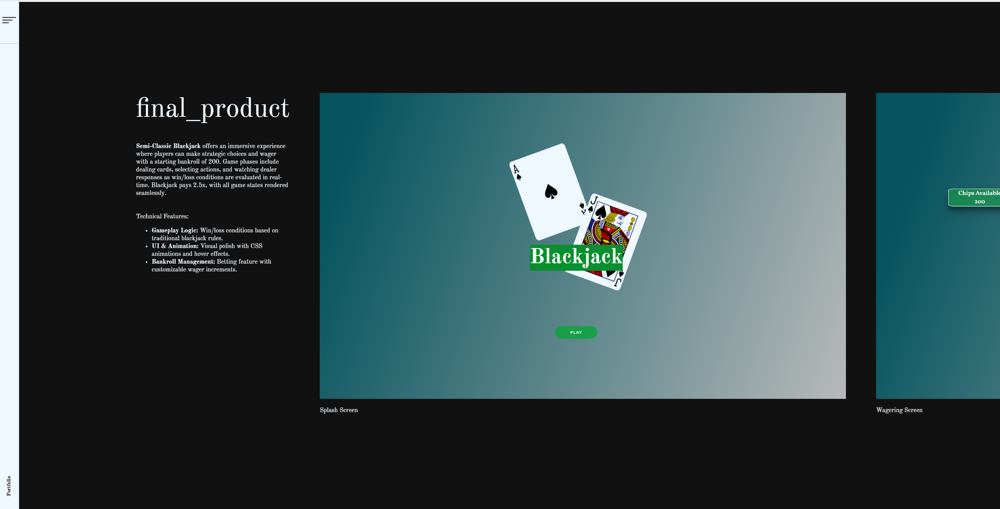
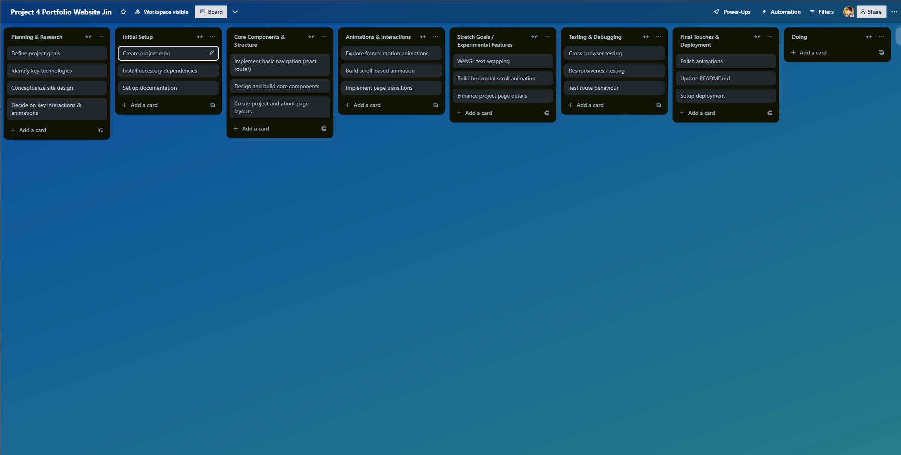
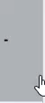
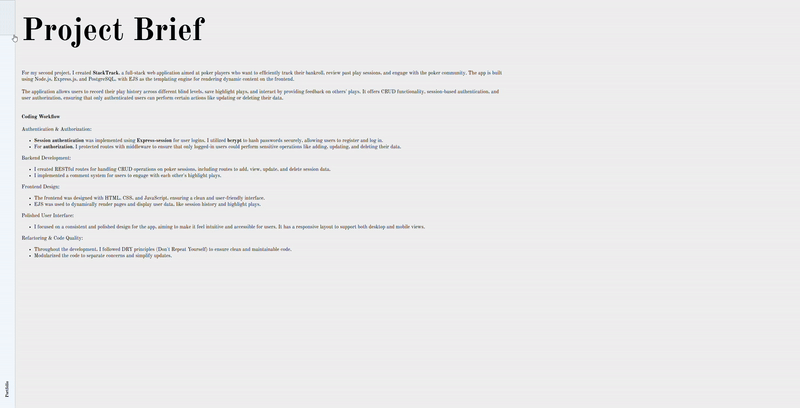
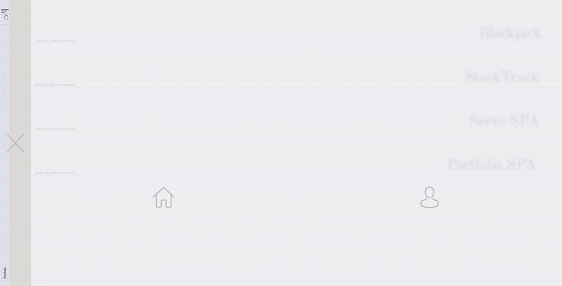

# Portfolio: React SPA - project4
Thank you for visiting my **Portfolio**, crafted as a Single Page Application (SPA) to provide a seamless and interactive browsing experience. 🎯

## About :open_book:
- This portfolio website was crafted to serve as a powerful digital resume, showcasing my skills, projects, and capabilities as a software engineer. 🖥️
- As a capstone to my bootcamp journey, the site combines modern web design with intuitive navigation, aiming to leave a lasting impression on potential employers and collaborators.✨
- To elevate the user experience, I integrated Framer Motion for fluid animations and React Router DOM for dynamic navigation, crafting a single-page application that feels expansive and engaging.

In-game screenshots :framed_picture:

## Core Features :star2:
- **Interactive Animations**: Using Framer Motion, I incorporated smooth, visually engaging animations and SVG effects to maintain a sleek, professional feel that captures attention without overwhelming the user.
- **Dynamic Navigation**: Leveraging React Router DOM, I simulated multi-page navigation within an SPA, ensuring consistent and seamless transitions across all pages.
- **Unique Scrolling Experience**: A custom scroll bar allows users to navigate both vertically and horizontally, offering a dynamic flow through the portfolio. With ``targetRef``, ``scrollYProgress``, and ``useTransform``, the scroll transitions enhance interactivity.
- **Polished Page Transitions**: Smooth entrance and exit animations provide a cohesive experience that reflects a minimalist design ethos.

## New Technologies and Challenges 🧪
- **Framer Motion:** This library facilitated engaging animations, like SVG line transitions on menu icons, which add personality and depth to the UI.
- **React Router DOM:** By structuring navigation with React Router DOM, I achieved a SPA that feels multi-page, combining a seamless experience with easy route management.
- **WebGL Exploration:** I initially aimed to incorporate a text-warping effect using Canvas, WebGL, and Three.js. Although the complexity and time constraints led me to defer this feature, the process enriched my understanding of 3D rendering concepts. Framer Motion provided a suitable alternative for animations while keeping the code maintainable.

## Planning & Problem Solving 🗺️
I meticulously planned this project to ensure smooth development, setting milestones and breaking down tasks into manageable parts with Trello for tracking. Here’s an outline of the main phases:
1. Project Setup and Tech Research:
- Initialize repository and review Framer Motion, React Router DOM, and WebGL for animation possibilities.
- Decide on feasible effects and outline the site’s primary goals. :gear:

2. Wireframing and Initial Setup:
- Organize sections for easy navigation and smooth transitions between Home, Portfolio, About, and Contact.

3. Core Development:
- Develop SPA structure with React Router DOM.
- Implement sidebar and seamless page transitions with animation hooks.

4. Advanced Features and Animations:
- Integrate Framer Motion animations, enhancing UX with subtle content transitions. :bulb:
- Develop and test the horizontal scroll bar for a unique scrolling experience.

5. Testing and Final Refinement:
- Ensure responsiveness across devices and browsers, polish animations, and align with the minimalist theme.

## In-Progress Screenshots :framed_picture:

## Technologies Used :computer:
- Frontend Framework: React for building a modular, component-based architecture
- Animations: Framer Motion for smooth, interactive animations and SVG transitions
- Routing: React Router DOM to simulate a multi-page experience within a Single Page Application (SPA)
- Styling: CSS for custom styles to achieve a clean, minimalist design
- State Management: React hooks like useState, useEffect, and useRef for dynamic component interaction
- Scrolling & Effects: scrollYProgress, useTransform, and targetRef for dynamic vertical and horizontal scrolling experiences
- Version Control: Git and GitHub for managing and tracking project changes

## Favourite Tech from the Project :battery:

## Lessons Learned :memo:
- **Power of Minimalist Design:** A clean, minimalist interface shifts focus to the showcased content, appealing to recruiters and establishing a professional impression.
- **Tool Adaptability:** WebGL posed challenges with implementation complexity, so adapting to Framer Motion allowed me to deliver a high-quality, animated experience effectively.
- **Importance of Modularization:** Isolating components streamlined the development process, making the project more organized and easier to iterate on.

## Future Features :rocket:
- **Enhanced Project Pages:** Plan to expand project details with additional sections and content to display a wider skill set.
- **WebGL and Canvas:** Revisit the text-warping effect with WebGL and Three.js as I gain more experience.
- **Increased Interactivity:** Experiment with additional interactive elements, building on the minimalist theme without overwhelming the user.